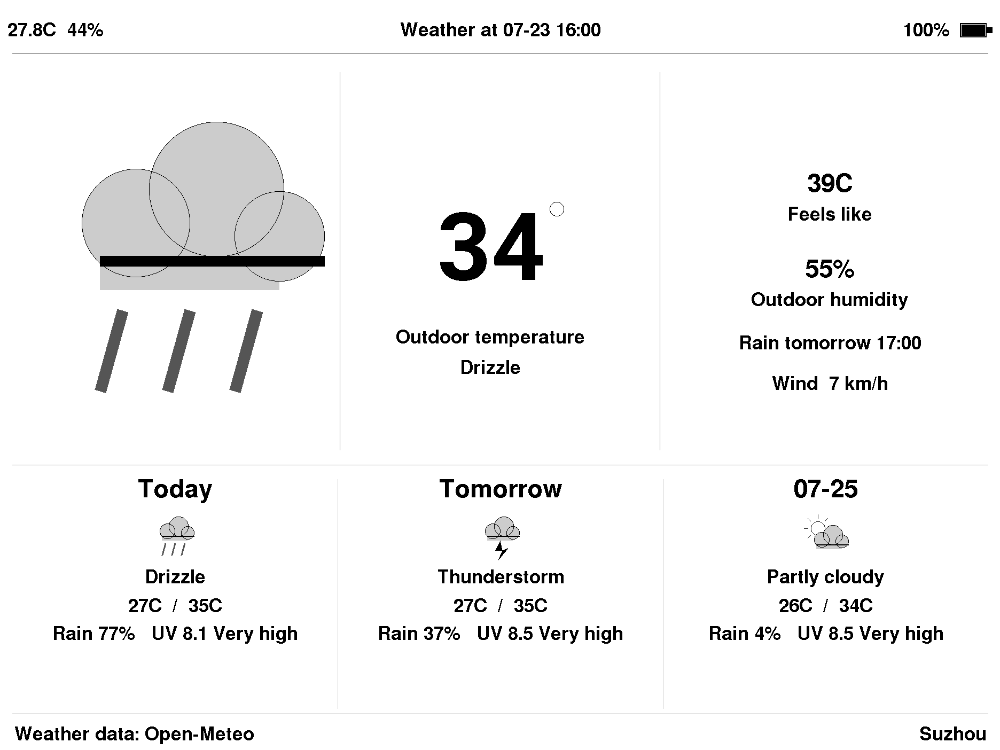

# Seeed reTerminal E100X Dashboards

[](https://github.com/danpodeanu/seeed-reterminal-E100X/actions/workflows/xkcd-viewer-build.yml)
[](https://github.com/danpodeanu/seeed-reterminal-E100X/actions/workflows/weather-viewer-build.yml)
[](https://github.com/danpodeanu/seeed-reterminal-E100X/actions/workflows/photo-viewer-build.yml)
[](https://github.com/danpodeanu/seeed-reterminal-E100X/actions/workflows/repository-checks.yml)
[](https://github.com/danpodeanu/seeed-reterminal-E100X/actions/workflows/codeql.yml)

A collection of applications for the Seeed Studio reTerminal E1001, E1002,
E1003, and E1004 e-paper displays.

These projects explore the E100X family as low-power, always-visible displays
for information that changes occasionally. Each application lives in its own
folder with its own setup instructions, dependencies, and supported-device
details.

## Applications

| Application | Description | Status |
| --- | --- | --- |
| [XKCD Viewer](xkcd-viewer/) | A battery-powered random XKCD display with model-aware scaling, optional SD caching, environmental readings, and deep sleep. | Available |
| [Weather Viewer](weather-viewer/) | A low-power current-conditions and three-day forecast display using Open-Meteo, local environmental readings, and deep sleep. | Available |
| [Photo Viewer](photo-viewer/) | A private, SD-card photo frame with panel-native preprocessing, full model-specific color, quiet hours, daily time sync, and deep sleep. | Available |

## XKCD Viewer example


This frame was captured directly from a reTerminal E1003 running the
[XKCD Viewer](xkcd-viewer/). Comic:
[XKCD #699 — Trimester](https://xkcd.com/699/).

## Weather Viewer example



This frame was captured directly from a reTerminal E1003 running the
[Weather Viewer](weather-viewer/).

## Future ideas

Possible additions include:

- A low-power clock and calendar.
- A household information dashboard.
- RSS, news, transit, or status displays.

These are ideas rather than committed features. New applications can use a
different framework or architecture where that better suits their use case.

## Repository layout

```text
.
├── .github/workflows/    # Repository-level build checks
├── xkcd-viewer/          # Standalone XKCD display firmware
├── weather-viewer/       # Standalone weather display firmware
├── photo-viewer/         # SD-card photo-frame firmware and preparation tool
└── README.md             # This project index
```

Each application should keep its source code, configuration examples, build
instructions, and documentation inside its own directory. Shared repository
automation belongs under `.github/workflows` and should use path filters so
unrelated applications do not trigger unnecessary builds.

## Hardware

The repository targets members of the Seeed Studio reTerminal E100X e-paper
family. Panel resolution, color capabilities, peripherals, and pin mappings
differ between models, so consult each application's README before building or
uploading firmware.

## Getting started

Choose an application from the table above and follow the instructions in its
README. Do not assume that firmware built for one E100X model is suitable for
another; select the exact device target during compilation.

## Testing

Each application has native unit tests for its production decision logic:

```bash
cd xkcd-viewer
pio test -c platformio-test.ini -e native_test
```

Use the same command inside `weather-viewer` or `photo-viewer`. Their GitHub
Actions workflows run these tests on every relevant push and pull request.

## Contributing

Keep applications self-contained and avoid committing credentials, generated
build directories, or firmware containing private configuration. When adding
a project, add it to the application table and provide a project-specific
README with supported hardware, configuration, build, upload, and operating
instructions.

This is an unofficial community repository and is not affiliated with Seeed
Studio.
