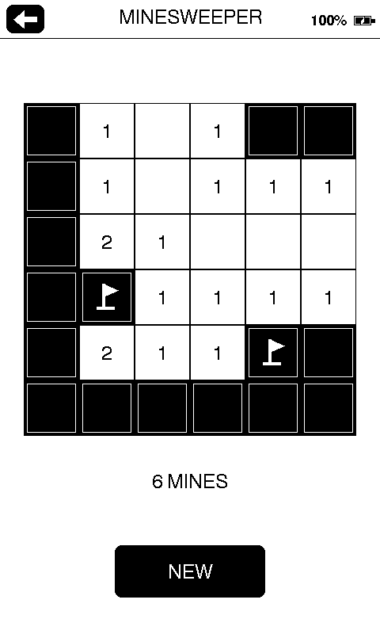

# Seeed reTerminal E100X Dashboards

[](https://github.com/danpodeanu/seeed-reterminal-E100X/actions/workflows/xkcd-viewer-build.yml)
[](https://github.com/danpodeanu/seeed-reterminal-E100X/actions/workflows/weather-viewer-build.yml)
[](https://github.com/danpodeanu/seeed-reterminal-E100X/actions/workflows/photo-viewer-build.yml)
[](https://github.com/danpodeanu/seeed-reterminal-E100X/actions/workflows/sticky-arcade-build.yml)
[](https://github.com/danpodeanu/seeed-reterminal-E100X/actions/workflows/sticky-fiddle-build.yml)
[](https://github.com/danpodeanu/seeed-reterminal-E100X/actions/workflows/repository-checks.yml)
[](https://github.com/danpodeanu/seeed-reterminal-E100X/actions/workflows/codeql.yml)
[](https://github.com/danpodeanu/seeed-reterminal-E100X/actions/workflows/release.yml)

A collection of applications for the
[Seeed Studio reTerminal E Series](https://wiki.seeedstudio.com/reterminal_e10xx_main_page/)
E1001, E1002, E1003, E1004, and E1005 ("Seeed Sticky") e-paper displays.

These projects explore the E100X family as low-power, always-visible displays
for information that changes occasionally. Each application lives in its own
folder with its own setup instructions, dependencies, and supported-device
details.

> ### 🔌 [Flash your reTerminal from the browser](https://danpodeanu.github.io/seeed-reterminal-E100X/)
>
> No installer, no `esptool.py`. Pick the board and application, plug in
> the USB-C cable, and Chrome or Edge writes the latest release straight
> to the device over Web Serial.

## Applications

| Application | Description | Status |
| --- | --- | --- |
| [XKCD Viewer](xkcd-viewer/) | A battery-powered random XKCD display with model-aware scaling, optional SD caching, Unicode titles, environmental readings, and deep sleep. | Available |
| [Weather Viewer](weather-viewer/) | A low-power current-conditions and three-day forecast display using QWeather or Open-Meteo, with local environmental readings, severe-weather alerts, Unicode location names, and deep sleep. | Available |
| [Photo Viewer](photo-viewer/) | A private, SD-card photo frame with panel-native preprocessing, full model-specific color, quiet hours, daily time sync, and deep sleep. | Available |
| [Sticky Arcade](sticky-arcade/) | Eighteen E1005 activities with fast refresh and resumable state: seventeen touch games plus a read-only SD browser and EPUB reader. | Available on E1005 |
| [Sticky Fiddle](sticky-fiddle/) | Nine no-pressure E1005 touch activities for idle hands, including Bubble Wrap, Zen Rake, Kaleidoscope, Inkblot, Pebble Stack, and Worry Stone. | Available on E1005 |

## XKCD Viewer example


This frame was captured directly from a reTerminal E1003 running the
[XKCD Viewer](xkcd-viewer/). Comic:
[XKCD #699 — Trimester](https://xkcd.com/699/).

## Weather Viewer example


This frame was captured directly from a reTerminal E1001 running the
[Weather Viewer](weather-viewer/).

## Sticky Arcade examples

| First selector page | Mini Minesweeper |
| --- | --- |
|  |  |

These frames were captured directly from a reTerminal E1005 running
[Sticky Arcade](sticky-arcade/).

The selector presents six games per page in this fixed, popularity-based order,
with EPUB Reader kept on the first page:

| Game | Description |
| --- | --- |
| Falling Blocks | Complete lines in a turn-based falling-block game adapted for e-paper. |
| Connect Four | Connect four discs against the built-in AI or in two-player pass-and-play. |
| Klondike | Play draw-one solitaire with movable tableau runs and four foundations. |
| Mahjong Solitaire | Match free tiles across a solvable 144-tile layered layout. |
| 2048 | Swipe and merge matching tiles while preserving the best score. |
| EPUB Reader | Browse an SD card without modifying it and read DRM-free reflowable EPUB 2/3 books. |
| Mini Minesweeper | Clear a first-tap-safe 6x6 field containing six mines. |
| Sudoku | Complete a randomly selected, uniquely solvable easy 9x9 puzzle. |
| Reversi / Othello | Play against the built-in AI or use two-player pass-and-play. |
| Word Search | Find six words in a generated 9x9 arcade-themed letter grid. |
| Crossword | Solve one of 100 easy mini crosswords with an on-screen QWERTY keyboard. |
| Sokoban | Push crates through all 155 Microban I levels with durable completion progress. |
| Dots and Boxes | Draw edges, complete boxes, and keep the turn after scoring. |
| Peg Solitaire | Jump and remove pegs from the classic cross-shaped board. |
| Lights Out | Toggle a square and its neighbours until the 5x5 board is dark. |
| Nonogram / Picross | Use row and column clues to reveal a hidden 5x5 picture. |
| Pipe Connect | Rotate 36 pipe tiles into one connected network. |
| Slitherlink | Draw one loop whose edges satisfy every numbered clue. |

All games preserve their current state across selector visits and deep sleep.
The EPUB reader resumes the same book, chapter, and page when the SD card is
still available. An optional SD-backed Noto font adds common Chinese, Japanese,
and Korean book text without increasing firmware flash usage.
Play counts are kept in RTC memory across deep sleep and reset after power loss
or reflashing. The interface supports English, Spanish, French, German, and
Simplified Chinese using fonts embedded in firmware flash. See the
[Sticky Arcade README](sticky-arcade/) for complete rules, controls, persistence details, and
puzzle-source attribution.

## Future ideas

Possible additions include:

- A low-power clock and calendar.
- A household information dashboard.
- RSS, news, transit, or status displays.

These are ideas rather than committed features. New applications can use a
different framework or architecture where that better suits their use case.

## Repository layout

```text
.
├── .github/workflows/    # Repository-level build checks
├── common/               # Shared driver, board pin, and helper code (e-paper setup, SD, RTC, sensors)
├── docs/                 # Web flasher (GitHub Pages)
├── xkcd-viewer/          # Standalone XKCD display firmware
├── weather-viewer/       # Standalone weather display firmware
├── photo-viewer/         # SD-card photo-frame firmware and preparation tool
├── sticky-arcade/        # Seventeen touch games and an EPUB reader for E1005
├── sticky-fiddle/        # Nine no-pressure touch activities for E1005
├── tools/                # Hardware utilities (i2c-scan, panel-test, sd-web)
└── README.md             # This project index
```

Each application should keep its source code, configuration examples, build
instructions, and documentation inside its own directory. Shared repository
automation belongs under `.github/workflows` and should use path filters so
unrelated applications do not trigger unnecessary builds.

## Hardware

The repository targets members of the Seeed Studio reTerminal E100X e-paper
family. Panel resolution, color capabilities, peripherals, and pin mappings
differ between models, so consult each application's README before building or
uploading firmware.

All three viewer applications support E1001-E1005, including the monochrome
Seeed reTerminal E1005 ("Seeed Sticky") in portrait and both landscape
directions. Sticky Arcade and Sticky Fiddle are intentionally E1005-only
because they depend on the integrated touch screen. E1005 hardware tools live
under `tools/`.
Model-specific firmware for supported combinations is included in releases.

## Getting started

Choose an application from the table above and follow the instructions in its
README. Do not assume that firmware built for one E100X model is suitable for
another; select the exact device target during compilation.

## USB screen capture

Every application and the panel test expose the current in-memory framebuffer
as an 8-bit indexed PNG over the same USB serial port used for firmware upload
and logs. Install the host dependency and run:

```bash
python -m pip install pyserial
python tools/capture_screen.py COM8
```

The default output is `screenshot-<unix-epoch>.png`; pass `-o path.png` to
choose another path. The client verifies the payload dimensions and CRC32
before installing the file. Large E1003/E1004 framebuffers can take several
minutes over the 115200-baud diagnostic port.

Capture requests are served only while the firmware remains active. Sticky Arcade also
wake from light sleep for a repeated capture request. Deep sleep has no capture
window, so request the image before putting the device to sleep.
The image retained by the e-paper itself cannot be read after its in-memory
framebuffer has been powered down. Normal serial log lines are ignored by the
client.

USB capture is enabled by default. To compile it out completely, add
`-D USB_SCREEN_CAPTURE_ENABLED=0` to the selected PlatformIO environment's
`build_flags`.

For pre-built firmware, the
[web flasher](https://danpodeanu.github.io/seeed-reterminal-E100X/) writes
the latest GitHub Release for all E1001-E1005 application/board combinations
directly from Chrome or Edge over USB. See
[`docs/`](docs/) for how the flasher is wired up.

## Updating firmware (SD card)

Firmware can be updated by dropping a single `.bin` file onto the SD card -
no cable, no serial console, no host tooling. The device verifies the image
before rebooting into it, so a wrong-model or corrupted file cannot brick a
running unit.

1. Download the **`-ota.bin`** release asset for your app + board from the [Releases page](https://github.com/danpodeanu/seeed-reterminal-E100X/releases) - for example, `firmware-weather-viewer-reterminal_e1003-ota.bin`. The matching `-full.bin` is only for USB / web-flasher first-flash and will **not** work over SD (see below).
2. Copy it to the root of the SD card as **`/update.bin`** (the filename is fixed and the same across apps and boards; the device tells them apart by an embedded tag inside the image).
3. Insert the SD card and wake the device (any button, or wait for the next automatic refresh).

At the next wake, the running firmware:

- streams `/update.bin` into the inactive OTA slot,
- verifies the embedded `reterminal-ota:E100x` model tag matches this board,
- lets ESP-IDF verify the SHA-256 baked into the image,
- switches the boot partition and reboots into the new image, then
- renames `/update.bin` to `update.bin.applied-<epoch>` on success, or `update.bin.failed-<reason>-<epoch>` on any failure (so the same bad file can't boot-loop the device).

The running firmware version is printed as `[boot] fw <version>` on the
serial log and shown on the Wi-Fi / config portal screen, next to the
device MAC, so you can confirm the upgrade landed without opening the
serial console.

**Two asset flavours per app + board.** Every release ships both:

- `firmware-<app>-<board>-full.bin` - merged bootloader + partitions + OTA
  selector + app, flashed at 0x0. Used by the **web flasher** and by any
  direct `esptool` USB flash. Do **not** feed this to SD OTA.
- `firmware-<app>-<board>-ota.bin` - app-only image consumed by
  `esp_ota_write` during SD OTA. Copy this one to `/update.bin`.

## Testing

Each application has native unit tests for its production decision logic:

```bash
cd xkcd-viewer
pio test -c platformio-test.ini -e native_test
```

Use the same command inside `weather-viewer` or `photo-viewer`. Their GitHub
Actions workflows run these tests on every relevant push and pull request.

Release qualification builds all 16 supported application/board combinations.

## Contributing

Keep applications self-contained and avoid committing credentials, generated
build directories, or firmware containing private configuration. When adding
a project, add it to the application table and provide a project-specific
README with supported hardware, configuration, build, upload, and operating
instructions.

This is an unofficial community repository and is not affiliated with Seeed
Studio.
