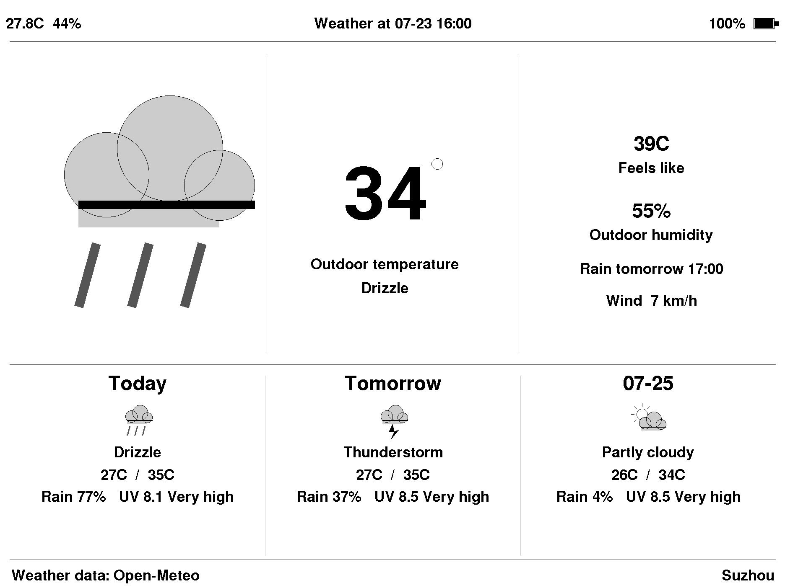

# Seeed reTerminal E100X Dashboards

[](https://github.com/danpodeanu/seeed-reterminal-E100X/actions/workflows/xkcd-viewer-build.yml)
[](https://github.com/danpodeanu/seeed-reterminal-E100X/actions/workflows/weather-viewer-build.yml)
[](https://github.com/danpodeanu/seeed-reterminal-E100X/actions/workflows/photo-viewer-build.yml)
[](https://github.com/danpodeanu/seeed-reterminal-E100X/actions/workflows/repository-checks.yml)
[](https://github.com/danpodeanu/seeed-reterminal-E100X/actions/workflows/codeql.yml)
[](https://github.com/danpodeanu/seeed-reterminal-E100X/actions/workflows/release.yml)

A collection of applications for the
[Seeed Studio reTerminal E Series](https://wiki.seeedstudio.com/reterminal_e10xx_main_page/)
E1001, E1002, E1003, and E1004 e-paper displays.

These projects explore the E100X family as low-power, always-visible displays
for information that changes occasionally. Each application lives in its own
folder with its own setup instructions, dependencies, and supported-device
details.

> ### 🔌 [Flash your reTerminal from the browser](https://danpodeanu.github.io/seeed-reterminal-E100X/)
>
> No installer, no `esptool.py`. Pick the board and application, plug in
> the USB-C cable, and Chrome or Edge writes the latest release straight
> to the device over Web Serial.

## Applications

| Application | Description | Status |
| --- | --- | --- |
| [XKCD Viewer](xkcd-viewer/) | A battery-powered random XKCD display with model-aware scaling, optional SD caching, Unicode titles, environmental readings, and deep sleep. | Available |
| [Weather Viewer](weather-viewer/) | A low-power current-conditions and three-day forecast display using QWeather or Open-Meteo, with local environmental readings, severe-weather alerts, Unicode location names, and deep sleep. | Available |
| [Photo Viewer](photo-viewer/) | A private, SD-card photo frame with panel-native preprocessing, full model-specific color, quiet hours, daily time sync, and deep sleep. | Available |

## XKCD Viewer example


This frame was captured directly from a reTerminal E1003 running the
[XKCD Viewer](xkcd-viewer/). Comic:
[XKCD #699 — Trimester](https://xkcd.com/699/).

## Weather Viewer example



This frame was captured directly from a reTerminal E1003 running the
[Weather Viewer](weather-viewer/).

## Future ideas

Possible additions include:

- A low-power clock and calendar.
- A household information dashboard.
- RSS, news, transit, or status displays.

These are ideas rather than committed features. New applications can use a
different framework or architecture where that better suits their use case.

## Repository layout

```text
.
├── .github/workflows/    # Repository-level build checks
├── common/               # Shared driver, board pin, and helper code (e-paper setup, SD, RTC, sensors)
├── docs/                 # Web flasher (GitHub Pages)
├── xkcd-viewer/          # Standalone XKCD display firmware
├── weather-viewer/       # Standalone weather display firmware
├── photo-viewer/         # SD-card photo-frame firmware and preparation tool
├── tools/                # Diagnostic sketches (i2c-scan, panel-test)
└── README.md             # This project index
```

Each application should keep its source code, configuration examples, build
instructions, and documentation inside its own directory. Shared repository
automation belongs under `.github/workflows` and should use path filters so
unrelated applications do not trigger unnecessary builds.

## Hardware

The repository targets members of the Seeed Studio reTerminal E100X e-paper
family. Panel resolution, color capabilities, peripherals, and pin mappings
differ between models, so consult each application's README before building or
uploading firmware.

All three applications support E1001, E1002, E1003, and E1004, with
model-specific firmware included in every release. E1001, E1002, and E1003
have been tested on real hardware. E1004 is built by CI but has not yet been
tested on real hardware.

## Getting started

Choose an application from the table above and follow the instructions in its
README. Do not assume that firmware built for one E100X model is suitable for
another; select the exact device target during compilation.

For pre-built firmware, the
[web flasher](https://danpodeanu.github.io/seeed-reterminal-E100X/) writes
the latest GitHub Release for any application × board combination directly
from Chrome or Edge over USB. See [`docs/`](docs/) for how it is wired up.

## Updating firmware (SD card)

Firmware can be updated by dropping a single `.bin` file onto the SD card -
no cable, no serial console, no host tooling. The device verifies the image
before rebooting into it, so a wrong-model or corrupted file cannot brick a
running unit. Devices running v1.4 or earlier first need the one-time
partition-layout migration described below.

1. Download the **`-ota.bin`** release asset for your app + board from the [Releases page](https://github.com/danpodeanu/seeed-reterminal-E100X/releases) - for example, `firmware-weather-viewer-reterminal_e1003-ota.bin`. The matching `-full.bin` is only for USB / web-flasher first-flash and will **not** work over SD (see below).
2. Copy it to the root of the SD card as **`/update.bin`** (the filename is fixed and the same across apps and boards; the device tells them apart by an embedded tag inside the image).
3. Insert the SD card and wake the device (any button, or wait for the next automatic refresh).

At the next wake, the running firmware:

- streams `/update.bin` into the inactive OTA slot,
- verifies the embedded `reterminal-ota:E100x` model tag matches this board,
- lets ESP-IDF verify the SHA-256 baked into the image,
- switches the boot partition and reboots into the new image, then
- renames `/update.bin` to `update.bin.applied-<epoch>` on success, or `update.bin.failed-<reason>-<epoch>` on any failure (so the same bad file can't boot-loop the device).

The running firmware version is printed as `[boot] fw <version>` on the
serial log and shown on the Wi-Fi / config portal screen, next to the
device MAC, so you can confirm the upgrade landed without opening the
serial console.

**Two asset flavours per app + board.** Every release ships both:

- `firmware-<app>-<board>-full.bin` - merged bootloader + partitions + OTA
  selector + app, flashed at 0x0. Used by the **web flasher** and by any
  direct `esptool` USB flash. Do **not** feed this to SD OTA.
- `firmware-<app>-<board>-ota.bin` - app-only image consumed by
  `esp_ota_write` during SD OTA. Copy this one to `/update.bin`.

**One-time migration to the OTA-capable partition layout.** Devices flashed
with **v1.4 or earlier** use a single-slot partition layout with no room for
a second OTA image. Upgrading to v1.5 requires a **one-time USB reflash**
(the [web flasher](https://danpodeanu.github.io/seeed-reterminal-E100X/)
works fine) to lay down the new partition table. Wi-Fi credentials and
other NVS settings survive the migration; SPIFFS is wiped but the apps do
not use it. Every update after that first hop is SD-driven.

## Testing

Each application has native unit tests for its production decision logic:

```bash
cd xkcd-viewer
pio test -c platformio-test.ini -e native_test
```

Use the same command inside `weather-viewer` or `photo-viewer`. Their GitHub
Actions workflows run these tests on every relevant push and pull request.

Release qualification builds all 12 application × board combinations.

## Contributing

Keep applications self-contained and avoid committing credentials, generated
build directories, or firmware containing private configuration. When adding
a project, add it to the application table and provide a project-specific
README with supported hardware, configuration, build, upload, and operating
instructions.

This is an unofficial community repository and is not affiliated with Seeed
Studio.
