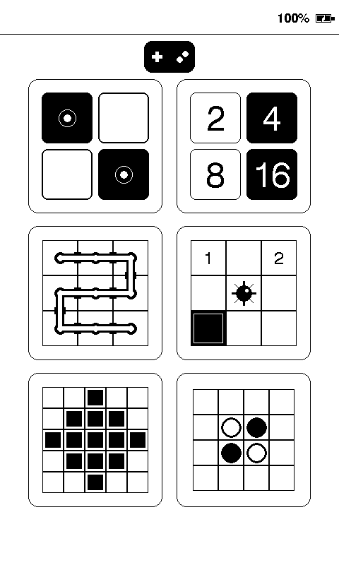

# Games

Touch-friendly games and an EPUB reader for the Seeed reTerminal E1005
("Seeed Sticky"). The app opens on an activity-selection screen so additional
activities can be added without installing separate firmware.

| First selector page | Mini Minesweeper |
| --- | --- |
|  |  |

The selector shows six activities per page, ordered from most used to least
used. Activities with equal use counts retain this default order:

| Game | Board or collection |
| --- | --- |
| Lights Out | Solvable generated 5x5 puzzles |
| 2048 | 4x4 sliding-tile board |
| Pipe Connect | Solvable generated 6x6 networks |
| Mini Minesweeper | First-tap-safe 6x6 fields with six mines |
| Nonogram / Picross | Generated 5x5 pictures |
| Reversi / Othello | 8x8, one-player AI or two-player mode |
| Dots and Boxes | Two-player 5x5 box board |
| Sokoban | All 155 Microban I levels |
| Peg Solitaire | Classic 33-hole English board |
| Slitherlink | Bundled 5x5 logic puzzles |
| Sudoku | 12 uniquely solvable easy 9x9 puzzles |
| Crossword | 100 easy 5x5 mini crosswords; engine supports up to 9x9 |
| Klondike | Standard 52-card draw-one solitaire |
| Mahjong Solitaire | Solvable 144-tile layered layouts |
| EPUB Reader | Read-only SD browser and paginated reflowable books |

## Included activities

### Lights Out

Tap a square to toggle it and its horizontal and vertical neighbours. Turn all
25 squares off to solve the puzzle. Every generated puzzle is solvable because
it is produced by applying a random sequence of legal moves to a cleared board.

Touch controls:

- Tap the Lights Out icon on the game-selection screen to play.
- Tap a board square to make a move.
- Tap **NEW** for another puzzle or **RESET** to restore the current puzzle.
- Tap the back arrow to save the current puzzle and return to the selection screen.
  Opening Lights Out again resumes that puzzle.

### 2048

Swipe the four-by-four board up, down, left, or right to slide matching tiles
together. A new 2 or 4 tile appears after each move that changes the board.
The score, best score, board, win state, and game-over state are restored when
you return from the selection screen or deep sleep.

Touch controls:

- Tap the 2048 icon on the game-selection screen to play or resume.
- Swipe across the board to move all tiles.
- Tap **NEW** to start over while retaining the best score.
- Tap the back arrow to save and return to the selection screen.

### Pipe Connect

Tap tiles to rotate their pipes until all 36 tiles form one connected network.
Every generated board starts from a connected spanning tree, so it always has a
solution. The current board and tap count persist across menu returns and deep
sleep.

Touch controls:

- Tap the Pipe Connect icon on the game-selection screen to play or resume.
- Tap a tile to rotate it clockwise.
- Tap **NEW** for another network or **RESET** to restore the current scramble.
- Tap the back arrow to save and return to the selection screen.

### Mini Minesweeper

Clear a six-by-six field containing six mines. The first revealed tile and its
neighbours are always safe. Empty areas open automatically, and the board,
flags, and win or loss state persist across menu returns and deep sleep.

Touch controls:

- Tap the Minesweeper icon on the game-selection screen to play or resume.
- Tap a covered tile to reveal it.
- Hold a covered tile for 650 ms, then release, to add or remove a flag.
- Tap a revealed number once that many adjacent tiles are flagged to open the
  other adjacent tiles.
- Tap **NEW** for another field.
- Tap the back arrow to save and return to the selection screen.

### Nonogram / Picross

Use the number clues above and beside the five-by-five grid to reveal the hidden
picture. Each clue describes a consecutive run of filled cells; separate clues
have at least one empty cell between them. The current puzzle and marks persist
across menu returns and deep sleep.

Touch controls:

- Tap the Nonogram icon on the game-selection screen to play or resume.
- Tap a cell to cycle it from blank, to filled, to crossed, then back to blank.
- Tap **NEW** for a different picture or **RESET** to clear the current grid.
- Tap the back arrow to save and return to the selection screen.

### Reversi / Othello

Two players take turns placing black and white discs on the eight-by-eight
board. A move must trap one or more opposing discs between the new disc and
another disc of the same colour; every trapped line is flipped. The player with
the most discs when neither player can move wins. One-player mode is the
default: the user plays Black and the built-in AI plays White. Two-player mode
keeps both colours under touch control.

Touch controls:

- Tap the Reversi icon on the game-selection screen to play or resume.
- Tap a dotted legal-move cell to place the current player's disc.
- Tap **1 PLAYER** or **2 PLAYERS** to switch modes and begin a new match.
- A player with no legal move passes automatically.
- Tap **NEW** to return to the standard four-disc opening.
- Tap the back arrow to save and return to the selection screen.

### Dots and Boxes

Two players take turns drawing one edge between adjacent dots. Completing a box
claims it and grants another turn. The player with the most boxes after all
edges have been drawn wins.

Touch controls:

- Tap near a horizontal or vertical edge to draw it.
- Tap **NEW** to start an empty board.
- Tap the back arrow to save and return to the selection screen.

### Sokoban

Push every crate onto a target across all 155 levels of David W. Skinner's
Microban I collection. Crates can be pushed but not pulled, so plan ahead to
avoid trapping one against a wall. The board scales automatically to fit levels
up to 30 columns by 17 rows. A black crate marked with a white circle is already
sitting on a target.

Touch controls:

- Tap anywhere on the board in the direction you want the worker to move. The
  worker steps once or pushes one crate, making even the smallest scaled boards
  easy to control.
- Tap **RESTART** to restart only the current attempt after a deadlock. It never
  changes completed-level progress.
- After solving a level, **NEXT** replaces **RESTART** and opens the next
  unfinished level.
- Tap the back arrow to save and return to the selection screen.

Microban I is copyright David W. Skinner and is redistributed with permission
and credit. See the
[author's redistribution notice](http://www.abelmartin.com/rj/sokobanJS/Skinner/David%20W.%20Skinner%20-%20Sokoban.htm)
and the [source level file](https://github.com/OMerkel/Sokoban/blob/master/3rdParty/Levels/Microban.txt).
Each completed level is saved immediately to non-volatile memory. After a power
loss or firmware update, Sokoban starts at the next unfinished level. Completion
progress never moves backward and can be cleared only by erasing NVM.

### Peg Solitaire

Clear the classic cross-shaped board by jumping one peg over an adjacent peg
into an empty hole. The jumped peg is removed; the ideal finish is one peg in
the center.

Touch controls:

- Tap a peg to select it, then tap a legal destination two holes away.
- Tap **RESET** to restore the full board with its center hole empty.
- Tap the back arrow to save and return to the selection screen.

### Slitherlink

Draw one continuous loop around the numbered cells. Each number says how many
of that cell's four edges belong to the loop. Crosses can mark edges that are
known not to be part of the solution.

Touch controls:

- Tap an edge to cycle it from blank, to line, to crossed, then back to blank.
- Tap **NEW** for the next puzzle or **RESET** to clear the current puzzle.
- Tap the back arrow to save and return to the selection screen.

### Sudoku

Complete a randomly selected easy 9x9 Sudoku. Every row, column, and thick
three-by-three box must contain the digits 1 through 9 exactly once. All bundled
puzzles have one verified solution.

Touch controls:

- Tap an empty square, then tap a solid black **1**-**9** key.
- Tap **X** to clear the selected square. Conflicting digits are rejected.
- Tap **NEW** for another random puzzle or **RESET** to clear your entries.
- Tap the back arrow to save and return to the selection screen.

### Crossword

Solve one of 100 randomly selected easy 5x5 mini crosswords. The model and
renderer support crossword grids up to 9x9. The word database comes from
[cout/minicross](https://github.com/cout/minicross) under its bundled MIT
license; the short text clues are original to this project.

Touch controls:

- Tap a white square to select it and open the QWERTY keyboard overlay.
- Tap an intersecting square again to switch between its Across and Down clues.
- Tap letters to enter answers, **DEL** to erase, or **OK** to close the
  keyboard.
- Tap **NEW** for another random crossword or **RESET** to clear the grid.
- Tap the back arrow to save and return to the selection screen.

### Klondike

Build descending tableau runs with alternating colours, expose hidden cards,
and move each suit from Ace through King onto its foundation. The draw-one
stock can be recycled without a pass limit.

Touch controls:

- Tap the stock to draw a card, or tap its empty outline to recycle the waste.
- Tap a face-up tableau card, the waste, or a foundation card to select it.
  Selected cards use a thicker outline.
- Double-tap the waste or a top tableau card to move it directly to its
  matching foundation when the next rank is available.
- Tap a tableau column to move the selected card or valid descending run.
  Only a King can move to an empty column.
- Tap the matching foundation to move a selected single card there.
- Exposed tableau cards turn face-up automatically after a move.
- Tap **NEW** for a freshly shuffled deal or **RESET** to replay the current
  deal.
- Tap the back arrow to save and return to the selection screen.

### Mahjong Solitaire

Remove matching pairs from a 144-tile, four-layer layout. A tile is free when
no tile covers it and at least one horizontal side is open. Each generated deal
has a known removal sequence, although choosing different matching pairs can
still lead to a dead end as in traditional Mahjong Solitaire.

Touch controls:

- Tap a free tile to select it, then tap a matching free tile to remove both.
- Tap another free tile to change the selection.
- Tap **NEW** for a newly shuffled layout or **RESET** to restore the current
  layout.
- Tap the back arrow to save and return to the selection screen.

### EPUB Reader

Insert an SD card and open the EPUB Reader tile to browse its folders. The
browser does not write, rename, delete, or format files. Directories are shown
first, followed by files in case-insensitive name order; non-EPUB files remain
visible but cannot be opened.

The reader supports standard DRM-free, reflowable EPUB 2 and EPUB 3 books. It
uses each book's package manifest and spine, extracts XHTML chapters, decodes
HTML entities, removes script and style content, and paginates the resulting
text. DRM, fixed-layout books, embedded scripting, advanced CSS, images, audio,
and video are not supported. A book may contain up to 96 spine entries, each
extracted chapter is limited to 512 KiB, and one browser folder displays up to
96 entries.

Touch controls:

- Tap a folder to enter it, or the back arrow to return to its parent. At the
  SD root, the back arrow returns to the activity selector.
- Tap an `.epub` file to open it. Tap **PREVIOUS** or **NEXT** to move between
  pages; page navigation continues across chapter boundaries.
- Tap the reading-screen back arrow to return to the book's folder.
- The current browser folder, book path, chapter, and page offset are retained
  in RTC memory. Waking from deep sleep reopens the same page when the SD card
  and book are still available; otherwise the reader returns to the browser.

For CJK books, download `fonts.zip` from the
[latest release](https://github.com/danpodeanu/seeed-reterminal-E100X/releases)
and unzip it at the SD-card root. This installs `/fonts/epub_cjk_16.vlw` plus
the 24px CJK browser font and shared Latin fonts.

To regenerate the CJK font from its pinned Noto Sans CJK SC Bold source:

```powershell
# Download once, from the repository root.
Invoke-WebRequest `
  https://raw.githubusercontent.com/notofonts/noto-cjk/f8d157532fbfaeda587e826d4cd5b21a49186f7c/Sans/OTF/SimplifiedChinese/NotoSansCJKsc-Bold.otf `
  -OutFile tools\fonts\NotoSansCJKsc-Bold.otf

# Replace E:\ with the mounted SD-card root.
python games\tools\generate_epub_cjk_font.py E:\
```

The generator verifies the pinned source font, creates the SD card's `fonts`
folder when needed, and writes `epub_cjk_16.vlw` for book text plus
`epub_cjk_24.vlw` for SD filenames. They are about 12 MB and 24.5 MB,
respectively, with 42,220 BMP glyphs each, covering common Simplified and
Traditional Chinese characters, Japanese kana and kanji, and Korean Hangul.
The source `.otf` does not need to be copied to the SD card. Rare
supplementary CJK Extension B and later characters above `U+FFFF` are not
supported by the display renderer.

If the 16px CJK file is absent, the reader uses `/fonts/sans_bold_16.vlw`
when available, then falls back to the flash-backed interface font. A CJK
chapter shows a localized **CJK FONT REQUIRED** message instead of blank text
when the required SD font is missing. The browser falls back to the 16px CJK
font if the 24px file is absent. CJK characters are treated as full-width
during pagination.

The selector uses three two-column pages with up to six activities each. It
automatically orders them by use count, from most used to least used,
and preserves
the default order for ties. Counts are retained in RTC memory through deep
sleep, but reset after power loss, RTC memory loss, or reflashing. Previous and
next arrows appear only when a page exists in that direction.

Front buttons:

- On the selection screen, **UP** opens the previous selector page and
  **DOWN** opens the next selector page. Pressing either at the corresponding
  first or last page boundary has no effect.
- While playing, **UP** saves the game and returns to the selection screen.
  This also leaves the EPUB browser or reader. **DOWN** has no in-game action.
- Release **OK** in under 2 seconds to save and enter deep sleep. Press
  **OK** again to resume.
- Hold **OK** for 2–5 seconds and release it to open the language selection
  screen.
- Holding **OK** for more than 5 seconds has no action.

Every actionable on-screen or front-button press gives an immediate
confirmation beep. Ordinary board-cell taps and ignored holds over 5 seconds
remain silent.

The interface supports English, Spanish, French, German, and Simplified
Chinese. The language screen appears on first boot until a language is saved
in NVM, and can be reopened with the 2–5 second **OK** gesture. Its Unicode
fonts are embedded in firmware flash, so language support does not require an
SD card. Crossword clues and answers remain in English.

The app beeps once at startup and when a game is opened from the selector.
While the app is open,
the ESP32-S3 enters light sleep between touch and button events, then wakes
immediately for input and logs each light-sleep entry and exit. Releasing
**OK** in under 2 seconds uses deep sleep for longer idle periods. Resume state
is stored in RTC slow memory, so normal sleep/resume cycles do not write to
flash or the SD card. The selected language and Sokoban completion are stored
in internal flash. The same saved deep sleep starts automatically after five
minutes without touch or button input. Below 10% battery, the app saves its
state, displays a recharge screen, and enters deep sleep unless USB-C power is
connected. The normal sleep screen includes a QR code for this repository. All
active screens show the current battery percentage and the shared battery
gauge used by the other viewer apps; the gauge displays a charging bolt while
USB-C power is connected. On each game screen, the back arrow, game title, and
battery status share the top bar above a full-width divider.

The SSD1677 path uses 40 MHz window transfers and reseeds both differential RAM
planes after every refresh. This keeps normal moves near the panel's physical
waveform limit while preventing one move from affecting earlier regions.

## Build and flash

```powershell
# From the repository root
pio run -d games -e reterminal_e1005

# Or build, upload, and monitor from games/
..\deploy.bat e1005
```

This firmware is E1005-only. Other reTerminal E-series environments are not
defined intentionally.

## SD firmware updates

The app checks for `/update.bin` on an inserted SD card during startup. Use the
E1005 Games `-ota.bin` release asset; model validation, rollback protection,
and failure-safe file renaming use the same shared updater as the viewer apps.

## Tests

```powershell
Set-Location games
pio test -c platformio-test.ini -e native_test
```
