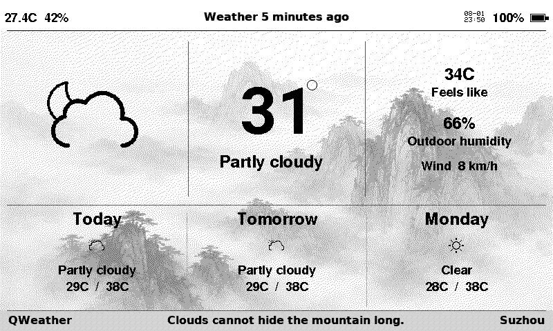

# Weather Viewer for reTerminal E1001–E1005

A low-power weather display for the Seeed Studio reTerminal E-series.
The device wakes on a schedule, downloads current conditions and a
short forecast, refreshes the e-paper panel, then switches Wi-Fi off
and returns to deep sleep. Between refreshes it draws essentially no
power while the panel stays visible.

The header includes local temperature and humidity from the built-in
SHT4x sensor plus battery status. E1005 fits compact versions around the
centered location in its simplified monochrome portrait layout.



*Frame captured directly from a reTerminal E1001 using the built-in
screenshot feature.*

## What it does

- Refreshes every 15 minutes by default (configurable).
- Current outdoor temperature, apparent temperature, humidity, wind,
  and a plain-language weather condition.
- Time and probability of the next expected rain in the coming 48 h.
- Three-day low/high with precipitation probability and maximum UV.
- Weather-matched ink-wash backgrounds, pre-dithered for each panel. E1005
  uses a light monochrome portrait treatment behind its compact layout.
- Severe-weather alert banner across the top when any local alert is
  active (QWeather in China; US NWS elsewhere in the US).
- Indoor temperature, humidity, battery percentage, and a USB-power
  indicator in the header. E1005 reads these from SHT4x and BQ27220.
- Overnight quiet hours (default 01:00–07:00) so the panel doesn't
  refresh while you're asleep.
- Optional SD-card cache so the last good forecast is redrawn even if
  the network is down.
- On-device Wi-Fi and location setup via a captive portal with QR
  codes.
- **SD-card firmware updates** - drop the app-only
  `firmware-*-ota.bin` from the [Releases page](https://github.com/danpodeanu/seeed-reterminal-E100X/releases)
  onto the SD card as `/update.bin` and the device applies it on the
  next wake, or on E1001-E1004 reconnect USB and re-run the
  [web flasher](https://danpodeanu.github.io/seeed-reterminal-E100X/)
  with the *Erase device* checkbox left unchecked to keep Wi-Fi
  credentials, portal config, and the cached forecast. See the top-level
  [README](../README.md#updating-firmware-sd-card) for details.

## Supported hardware

| Environment | Panel | Native output |
| --- | --- | --- |
| `reterminal_e1001` | 800×480 UC8179 | 4-level gray |
| `reterminal_e1002` | 800×480 ED2208 | six-color |
| `reterminal_e1003` | 1872×1404 ED103TC2 | 16-level gray |
| `reterminal_e1004` | 1200×1600 T133A01 | six-color |
| `reterminal_e1005` | 480×800 SSD1677 | monochrome |

Use the firmware environment matching your device; panel drivers and
dimensions differ between models.

You will also need:

- A 2.4 GHz Wi-Fi network with internet access.
- A data-capable USB-C cable for the first flash.
- **Optional:** a FAT32 or exFAT microSD card for the forecast cache,
  screenshots, and Unicode fonts (used for non-ASCII location names).
- **Optional:** a CR1220 coin cell so the onboard PCF8563 hardware
  clock keeps time while the physical power switch is off.

## Getting started

### 1. Flash the firmware

For E1001-E1005, the fastest path is the web flasher - no installer,
no `esptool.py`:

> [Flash your reTerminal from the browser →](https://danpodeanu.github.io/seeed-reterminal-E100X/)

Pick the reTerminal model, select **Weather Viewer**, connect over
USB-C, and Chrome or Edge writes the latest release directly. E1005 uses its
model-specific 32 MB boot chain automatically. To build from source instead,
see [Building from source](#building-from-source).

### 2. Connect the device to Wi-Fi and pick a location

On first boot (and any time no Wi-Fi is configured) the device raises
its own captive-portal access point and shows two QR codes on the
panel:

- Scan the first QR from a phone to join the AP — the SSID is
  `ReTerminal xxxxxx` with a device-specific password (also printed
  on the panel).
- Scan the second QR to open the settings page in a browser.

Every setting that used to require editing header files is editable
from that page: Wi-Fi credentials, weather provider, location
(latitude/longitude and a display name), timezone, NTP servers, quiet
hours, refresh cadence, and the QWeather API credentials. Values
persist in NVS and survive reflashing. The Reset pane wipes the Wi-Fi
and app namespaces so the device reverts to the compile-time
defaults.

You can re-enter the portal at any time: **while the device is
sleeping, hold the green button (E1001-E1004) or OK (E1005) for
1–5 seconds**. Wait for the first
beep and keep holding — when the panel switches to the QR-code portal
you're in.

### 3. Choose a weather provider

Two providers are supported:

- **Open-Meteo** (default). No account, no key, no rate limit
  configuration required. Works globally.
- **QWeather** (和风天气). Requires a free QWeather developer account
  authenticated with an Ed25519 JWT. Better coverage inside mainland
  China. Set up steps are in [QWeather setup](#qweather-setup) below.

Both providers use the same latitude/longitude and the same on-panel
layout.

### 4. Optional: insert an SD card

Weather Viewer works without a card. Adding one enables:

- A last-good forecast cache under `/weather/forecast.json`. On a
  normal wake, a saved forecast is redrawn without a network request
  as long as it is no older than the sleep interval.
- Screenshots captured via a long primary-button hold, written to
  `/screenshot.png`.
- Unicode location names (`Muenchen`, `São Paulo`) rendered via
  `.vlw` smooth fonts in `/fonts/`. Without the fonts, non-ASCII
  characters fall back to the built-in GFX font and render as
  garbage.

Fonts can be seeded with the xkcd viewer's preloader (they are
shared between apps):

```bash
python3 ../xkcd-viewer/tools/preload_sd.py /Volumes/SD --with-fonts
```

or via `tools/fonts/make_vlw.py` directly.

**Prebuilt fonts (no Python needed).** The repository ships the
prebuilt `.vlw` set under [`../fonts/`](../fonts/), and every tagged
release attaches a `fonts.zip` bundle to the release page. Copy
`fonts/*.vlw` from a clone, or download the bundle from
<https://github.com/danpodeanu/seeed-reterminal-E100X/releases> and unzip
it at the SD-card root.

## Using the viewer

- **Every 15 minutes** (default) the device wakes, refreshes the
  forecast, redraws the panel, and returns to sleep.
- **Buttons on the front** all wake the device:
  - Any front button → force an immediate live refresh (bypasses
    HTTP caches).
  - **Green/OK button + 1–5 s hold from sleep** → open the Wi-Fi
    configuration portal (QR codes on the panel).
  - **Green/OK button + longer hold (>5 s) from sleep** → save a
    screenshot of the current frame to `/screenshot.png`.
- **Header readouts** update on every refresh:
  - Indoor temperature and humidity (SHT4x).
  - Battery percentage plus a lightning bolt when USB power is
    connected (SY6974B-equipped boards only; older revisions with
    ETA6003 silently omit the icon).
  - E1005 uses compact badges beside the centered location name.
- **E1005 orientation** is selectable under **Settings → Presentation**:
  `Portrait`, `RotateCW`, or `RotateCCW`. Both landscape choices use the
  800×480 dashboard and a native landscape background.
- **Severe-weather alerts** appear as a shaded
  `! Alert: <title> (+N more)` bar above the current-temperature
  area whenever the configured provider reports an active alert for
  your location.
- **Quiet hours** (default 01:00–07:00) suppress automatic refreshes
  overnight. Cold boots and button wakes still refresh; the last
  scheduled frame before quiet hours re-labels itself
  `sleeping until 07:00`.
- **When the forecast can't be fetched**, the device falls back to a
  reasonably fresh SD-cached forecast if one exists. If neither is
  available, an error screen explains what failed and the device
  enters button-only sleep until you press any front button.
- **Between refreshes** Wi-Fi is off, the ADC battery-measurement
  circuit on E1001-E1004 is off, and the e-paper image stays visible.

## Troubleshooting

- **Panel is stuck on "Connecting to <SSID>"** — the stored Wi-Fi
  credentials probably don't match your network. Re-enter the portal
  (hold green/OK 1–5 s while sleeping) and update them.
- **Panel shows "Weather unavailable"** — either the internet is
  down, the API credentials are wrong (QWeather), or the location
  coordinates are invalid. The detail line names which step failed;
  press any button to retry.
- **QWeather alert bar never appears** — the free tier requires the
  *Weather Warning* data resource to be bound to your project in the
  QWeather console. Without that binding the endpoint returns HTTP
  403.
- **Location name renders as boxes on the panel** — the Unicode
  smooth fonts are missing from the SD card. Regenerate them (see
  [Getting started, step 4](#4-optional-insert-an-sd-card)) or edit
  the location name to ASCII.
- **Log timestamps show 1970-01-01** — the clock hasn't synced yet;
  NTP runs on cold boot and at most once every six hours after that.

---

## Technical details

Everything below is for developers building, extending, or debugging
the firmware.

### Building from source

Install [PlatformIO Core](https://platformio.org/install/cli). A safe
`include/secrets.h` containing standard placeholders is tracked, so a
clean checkout builds without an extra setup step. Editing it for
compile-time provisioning is optional and covered in
[Compile-time configuration](#compile-time-configuration) below; never
commit a customized copy.

Build the environment matching the physical device:

```bash
pio run -e reterminal_e1001
pio run -e reterminal_e1001 --target upload \
  --upload-port /dev/cu.usbserial-11410
```

For E1003 on Linux:

```bash
pio run -e reterminal_e1003
pio run -e reterminal_e1003 --target upload --upload-port /dev/ttyUSB0
```

For E1005 on Windows, the repository deploy helper builds the 32 MB
target, auto-detects the serial port when possible, uploads, and opens
the monitor:

```bat
..\deploy.bat e1005
```

Monitor logs:

```bash
pio device monitor --port /dev/ttyUSB0 --baud 115200
```

Logging uses UART1 on GPIO43/GPIO44, matching the carrier USB-to-UART
bridge. Every application log line starts with local time in
`[YYYY-MM-DD HH:MM:SS.mmm]` format. Before the clock is
synchronized, the same format intentionally shows a 1970 date.

### Compile-time configuration

Every runtime setting is editable from the on-device portal and
persists in NVS across reflashes, so **no compile-time configuration
is required** to build and run the firmware — a stock `pio run` will
launch the portal on first boot and let you configure Wi-Fi, the
weather provider, location, and quiet hours from the browser.

Configuring compile-time defaults is optional but useful when you
want to flash many devices without having to run the portal on each
one (automated provisioning), or when you want the firmware to come
up already knowing the network:

- **`include/secrets.h`** — Wi-Fi credentials and (optionally) the
  QWeather project/JWT fields. Required at build time (the copy step
  in [Building from source](#building-from-source) creates it), but
  editing is optional. Fill in `WIFI_SSID` / `WIFI_PASSWORD` (and the
  `QWEATHER_*` fields if you're using that provider) to seed
  defaults; the placeholder values `YOUR_WIFI_NAME` /
  `YOUR_QWEATHER_PROJECT_ID` etc. are treated as "unconfigured", so
  leaving them in place still boots straight into the portal.

- **`include/config.h`** — user-facing behavior defaults (weather
  provider selection, location, refresh cadence, quiet hours,
  timezone, rain thresholds). Every entry is overridable from the
  portal at runtime; edit the header only if you want to change what
  a fresh device comes up with.

- **`include/system_config.h`** — implementation-level knobs (panel
  geometry, timing budgets, cache paths, retry windows). Included
  from the bottom of `config.h`; you should not usually need to touch
  these.

The example forecast location is London:

```cpp
constexpr char LOCATION_NAME[] = "London";
constexpr double LATITUDE = 51.5074;
constexpr double LONGITUDE = -0.1278;
```

The same latitude/longitude are used regardless of which weather
provider you pick.

`LOCATION_NAME` may contain non-ASCII characters (e.g. "München",
"São Paulo") — the panel renders the header title, footer provider
label, and location name via a TFT_eSPI `.vlw` smooth font loaded
from `/fonts/sans_bold_<size>.vlw` on the SD card. Those files are
shared with the xkcd viewer; grab the prebuilt bundle from
[`../fonts/`](../fonts/) or a
[release](https://github.com/danpodeanu/seeed-reterminal-E100X/releases)
(look for `fonts.zip`), or regenerate with
`xkcd-viewer/tools/preload_sd.py --with-fonts` or
`tools/fonts/make_vlw.py`. Without the SD card (or the font file),
those strings fall back to the built-in GFX FreeSansBold font and any
non-ASCII bytes render as garbage; the rest of the panel is
unaffected.

Select a weather provider in `include/config.h`:

```cpp
constexpr WeatherProvider WEATHER_PROVIDER = WeatherProvider::OpenMeteo;
// constexpr WeatherProvider WEATHER_PROVIDER = WeatherProvider::QWeather;
```

### QWeather setup

Sign up at <https://dev.qweather.com/>, create a project, create a
credential of type "JWT", and download the ed25519 private key PEM.
Then add to `include/secrets.h`:

```cpp
#define QWEATHER_API_HOST       "devapi.qweather.com"   // or your paid host
#define QWEATHER_PROJECT_ID     "<your project id>"     // JWT "sub"
#define QWEATHER_CREDENTIAL_ID  "<your credential id>"  // JWT "kid"
#define QWEATHER_PRIVATE_KEY_HEX "<64 hex chars>"
```

The QWeather console also shows a **Developer ID** at the account
level — it is not used by the JWT and does not need to be stored.

Extract the 32-byte ed25519 seed as 64 hex characters from the
downloaded PEM with:

```bash
openssl pkey -in ed25519-private.pem -text -noout
```

Copy the `priv:` bytes (removing colons and whitespace) into
`QWEATHER_PRIVATE_KEY_HEX`. The firmware generates a fresh JWT on
every fetch cycle using `rweather/Crypto` and sends it as an
`Authorization` bearer token.

Language for QWeather's textual fields (condition names, warning
titles) is controlled by `QWEATHER_LANG` in `include/config.h`.
Common values are `"en"`, `"zh"` (Simplified Chinese, upstream
default), `"zh-hant"`, `"de"`, `"es"`, `"fr"`, `"ja"`, `"ko"`,
`"ru"`. Ignored when the active provider is Open-Meteo.

### Severe-weather alerts

Two independent opt-ins in `include/config.h` control which upstream
is consulted:

- `QWEATHER_ALERTS_ENABLED` (default `true`): fetch
  `/v7/warning/now` from QWeather on every refresh. On the free tier
  the endpoint requires the "Weather Warning" data resource to be
  bound to your project in the QWeather console; unbound projects
  return HTTP 403 and no alert bar is shown. Toggle to `false` to
  skip the guaranteed-to-fail round-trip. Has no effect on the
  Open-Meteo path.
- `NWS_ALERTS_ENABLED` (default `false`): fetch
  `api.weather.gov/alerts/active` from the US National Weather
  Service. Free, no key, but coverage is US only — flip to `true`
  only if the device sits in a US state or territory. Non-US points
  return HTTP 400 so leaving it on outside the US would just waste
  bandwidth. Has no effect on the QWeather path.

Open-Meteo itself does not expose a government-alerts endpoint, so
the Open-Meteo path shows alerts only when `NWS_ALERTS_ENABLED` is on
and the device is in NWS coverage.

### Time and NTP

Default time settings in `include/config.h`:

```cpp
constexpr char TIMEZONE[] = "GMT0BST,M3.5.0/1,M10.5.0";
constexpr char NTP_SERVER_PRIMARY[] = "pool.ntp.org";
constexpr char NTP_SERVER_SECONDARY[] = "time.cloudflare.com";
constexpr uint32_t NTP_DHCP_TIMEOUT_MS = 6000;
```

The firmware requests NTP servers through DHCP option 42 before
acquiring its Wi-Fi lease. If DHCP supplies no server, or that server
does not respond within the configured DHCP timeout, it falls back
to the two servers above. The six-second default includes up to five
seconds of randomized SNTP startup delay in Arduino-ESP32; it is not
solely a server-response timeout.

After a successful NTP synchronization, the firmware stores UTC in
the onboard PCF8563 hardware RTC. If a later deep-sleep wake cannot
synchronize with NTP, the PCF8563 restores the ESP32 clock only when
its voltage-low (`VL`) flag is clear. An invalid or rolled-back ESP
clock is also recovered from the PCF8563 before NTP eligibility,
quiet hours, or cached-forecast freshness is evaluated. Cold boots
log the stored UTC value and `VL` state. A CR1220 coin cell is
required for reliable retention while the physical power switch is
off.

The London rule uses GMT in winter and BST from the last Sunday in
March until the last Sunday in October. The centered `Weather at`
timestamp on the panel identifies the weather data's valid time; it
is not the NTP request time.

### Cadence, quiet hours, and rain thresholds

```cpp
constexpr uint64_t SLEEP_SECONDS = 15ULL * 60ULL;
constexpr bool QUIET_HOURS_ENABLED = true;
constexpr uint8_t QUIET_START_HOUR = 1;
constexpr uint8_t QUIET_START_MINUTE = 0;
constexpr uint8_t QUIET_END_HOUR = 7;
constexpr uint8_t QUIET_END_MINUTE = 0;

constexpr uint8_t RAIN_FORECAST_HOURS = 48;
constexpr float RAIN_START_THRESHOLD_MM = 0.1f;
constexpr uint8_t RAIN_PROBABILITY_THRESHOLD = 30;
```

Rain timing examines the next 48 hourly intervals and selects the
first with at least 0.1 mm of forecast liquid precipitation and,
when probability data is available, at least 30% probability.

### Forecast cache

An SD card is optional. When present, the firmware atomically stores
the last successful API response as `/weather/forecast.json`. On
normal cold and timer wakes, a saved forecast is used without another
Open-Meteo request when its timestamp is no more than `SLEEP_SECONDS`
old. Button wakes remain explicit live refreshes. Older forecasts are
rejected. A cold boot can still connect for NTP before validating the
saved timestamp. Without a card, live weather works normally.

If neither live weather nor a sufficiently fresh saved forecast is
available, the display explains the live and cache failures, then
enters button-only deep sleep. Automatic timer retries remain
disabled until a front button or hardware reset starts another
attempt.

Weather icons are vector graphics built into the firmware, not
downloaded images, so they consume no network traffic and require no
SD cache.

### Weather data

The Open-Meteo path calls:

```text
https://api.open-meteo.com/v1/forecast
```

It requests current temperature, apparent temperature, relative
humidity, weather code and wind speed; hourly precipitation
probability, precipitation, rain and showers; plus daily weather
code, low/high temperature, maximum UV index, and maximum
precipitation probability. Open-Meteo chooses the forecast models
appropriate for the configured coordinates.

For regions where Open-Meteo does not provide native 15-minute model
data, exact rain onset remains an hourly forecast estimate rather
than a radar nowcast.

HTTPS certificate verification is disabled because the firmware does
not carry a CA bundle. The tracked `include/secrets.h` contains only
placeholders. Any Wi-Fi or QWeather credentials added to a local
customized copy are compiled into the binary; never commit that copy
or publish its firmware binaries.

### Operational notes

- Cold boot/reset displays the station MAC above `Connecting to
  <SSID>`.
- Every startup logs a `[wake]` line with the local time and whether
  it was a cold boot/reset, scheduled timer, or front-button wake.
- Timer wakes update every 15 minutes without an intermediate status
  refresh.
- Any front button wakes the device, beeps once, and forces an
  immediate live API update that bypasses HTTP caches.
- Wi-Fi is switched off as soon as the weather response is parsed,
  before cache writing, frame composition, and panel refresh. The
  battery measurement circuit is switched off during sleep.

### Development

Build all targets before submitting changes:

```bash
pio run -e reterminal_e1001 -e reterminal_e1002 \
  -e reterminal_e1003 -e reterminal_e1004 -e reterminal_e1005
```

Run the native unit tests:

```bash
pio test -c platformio-test.ini -e native_test
```

The tests cover quiet-hour boundaries, wake overrides, BQ27220 decoding,
compact portrait geometry, and daily refresh timing. GitHub Actions runs
them alongside all five firmware builds.

### References

- [Open-Meteo Weather Forecast API](https://open-meteo.com/en/docs)
- [QWeather Developer Portal](https://dev.qweather.com/)
- [Seeed PlatformIO setup](https://wiki.seeedstudio.com/epaper_work_with_platformio/)
- [Seeed reTerminal E-series Arduino guide](https://wiki.seeedstudio.com/reterminal_e10xx_with_arduino/)

This is an unofficial project and is not affiliated with Open-Meteo,
QWeather, or Seeed Studio.
